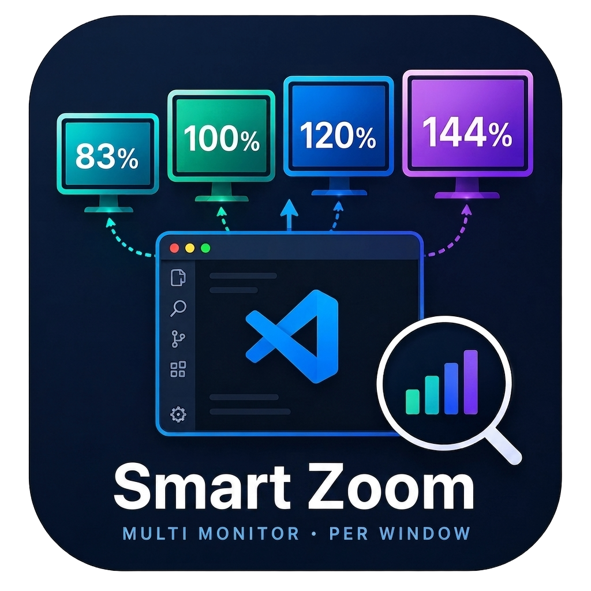
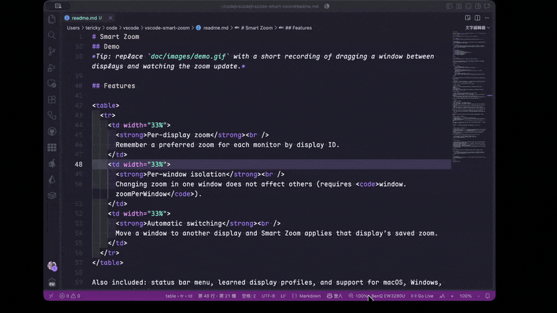

# Smart Zoom

Languages: [English](../readme.md) | [繁體中文](README.zh-TW.md) | [简体中文](README.zh-CN.md) | [日本語](README.ja.md)

  

  <strong>多螢幕工作時，讓每台顯示器都有合適的視窗縮放。</strong>

  Smart Zoom 會依 VS Code（或 Cursor 等相容編輯器）視窗目前所在的顯示器，自動套用對應縮放；各個視窗彼此獨立，不會互相影響。

  

  <a href="#demo">示範</a> ·
  <a href="#功能特色">功能特色</a> ·
  <a href="#開始使用">開始使用</a> ·
  <a href="#指令">指令</a> ·
  <a href="#設定">設定</a> ·
  <a href="#支持本專案">支持本專案</a>

## Demo

  

## 功能特色

<table>
  <tr>
    <td width="33%">
      <strong>依顯示器記住縮放</strong> 
      以 Display ID 為每台顯示器保存偏好的縮放等級。
    </td>
    <td width="33%">
      <strong>視窗互不干擾</strong> 
      只調整目前視窗的縮放，其他視窗維持原樣（需啟用 <code>window.zoomPerWindow</code>）。
    </td>
    <td width="33%">
      <strong>拖過去就切換</strong> 
      視窗換到另一台顯示器時，自動套用該顯示器已儲存的縮放。
    </td>
  </tr>
</table>

另提供狀態列快捷選單、可學習的顯示器設定檔，並支援 macOS、Windows 與 Linux（X11）。

## 系統需求

> **請先確認：** `"window.zoomPerWindow": true`（VS Code 預設為開啟）。Smart Zoom 以單一視窗為單位套用縮放；若關閉此選項，會顯示警告且無法正常運作。

- VS Code `^1.85.0`，或 Cursor 等相容編輯器

| 平台             | 支援狀況                                                 |
| ---------------- | -------------------------------------------------------- |
| macOS            | 完整支援；若偵測不穩，可能需要「螢幕錄製」權限           |
| Windows          | 完整支援                                                 |
| Linux（X11）     | 完整支援                                                 |
| Linux（Wayland） | 有限制：無法自動判斷顯示器（詳見 [已知限制](#已知限制)） |

## 開始使用

1. 從 Marketplace 安裝 **Smart Zoom**，或安裝 VSIX 套件。
2. 在設定中確認 `"window.zoomPerWindow"` 為 `true`。
3. 將視窗移到第一台顯示器，點一下狀態列的 Smart Zoom，選好縮放等級。
4. 再移到第二台顯示器，設成另一個縮放。
5. 在兩台顯示器之間拖曳視窗，縮放應會跟著切換。

也可以按 `F1` 開啟命令選擇區，執行 **Smart Zoom: Status Menu**。

## 指令

| 指令                                                           | 說明                                                                                       |
| -------------------------------------------------------------- | ------------------------------------------------------------------------------------------ |
| `Smart Zoom: Enable`                                           | 開啟自動縮放                                                                               |
| `Smart Zoom: Disable`                                          | 關閉自動縮放                                                                               |
| `Smart Zoom: Detect Current Display`                           | 偵測目前視窗所在顯示器並顯示狀態                                                           |
| `Smart Zoom: Status Menu` / `Configure Current Display (Menu)` | 開啟選單：調整縮放、偵測、清除設定或開關功能                                               |
| `Smart Zoom: Zoom In Current Display`                          | 將目前顯示器放大一階，並記住設定                                                           |
| `Smart Zoom: Zoom Out Current Display`                         | 將目前顯示器縮小一階，並記住設定                                                           |
| `Smart Zoom: Show Status`                                      | 顯示目前顯示器資訊，並開啟「輸出」日誌                                                     |
| `Smart Zoom: Clear All Learned Settings`                       | 清除所有已學習的顯示器設定與規則，並將目前視窗設回縮放等級 0（100%），不會再寫入新的設定檔 |

## 設定

平常使用大多點狀態列選單就夠了。進階選項位於設定中的 **Smart Zoom**：

| 設定項                   | 預設值 | 說明                                                                                                        |
| ------------------------ | ------ | ----------------------------------------------------------------------------------------------------------- |
| `smartZoom.enabled`      | `true` | 是否啟用 Smart Zoom                                                                                         |
| `smartZoom.pollInterval` | `500`  | 無法使用 watch 模式時（例如 Windows／Linux 輪詢），每隔多少毫秒檢查視窗位於哪一台顯示器。數值愈大愈省 CPU。 |
| `smartZoom.defaultZoom`  | `0`    | 找不到對應設定或規則時的預設縮放（`0` 約等於 100%）                                                         |

此處的縮放等級為 VS Code 的整數視窗縮放（大約每階 ±20%：`0` → 100%、`1` → 120%、`-1` → 83%……）。

<strong>進階設定與縮放決定方式</strong>

 

| 設定項                      | 預設值 | 說明                                                                       |
| --------------------------- | ------ | -------------------------------------------------------------------------- |
| `smartZoom.stabilityChecks` | `2`    | 套用顯示器變更前，需連續幾次偵測結果一致（避免卡在兩台螢幕交界時縮放跳動） |
| `smartZoom.displayProfiles` | `{}`   | 依顯示器記住的設定檔（通常由介面自動寫入）                                 |
| `smartZoom.zoomRules`       | `[]`   | 依解析度與 scale factor 比對的規則（通常由介面自動寫入）                   |

視窗穩定落在某台顯示器後，縮放依下列優先順序決定：

1. 該顯示器 Display ID 已儲存的 **display profile**
2. 否則，符合寬×高×scale factor 的 **zoom rule**
3. 再否則，使用 **`smartZoom.defaultZoom`**

## 已知限制

- **僅支援整數縮放** — 受限於編輯器公開 API，無法提供精確的小數 per-window zoom。
- **Wayland** — 無法自動偵測顯示器；會顯示一次警告，並維持目前縮放不變。
- **不會以全域 `window.zoomLevel` 作為單一視窗狀態** — 只調整焦點視窗，其他視窗不受影響。
- **macOS 權限** — 若持續偵測失敗，請在系統設定為編輯器開啟「螢幕錄製」後，重新載入視窗再試。

## 支持本專案

若 Smart Zoom 對你有幫助，歡迎請我喝杯咖啡：

  

  問題回報與功能建議：<a href="https://github.com/tericky/vscode-smart-zoom/issues">GitHub Issues</a>

## 授權條款

[Apache-2.0](../LICENSE)
